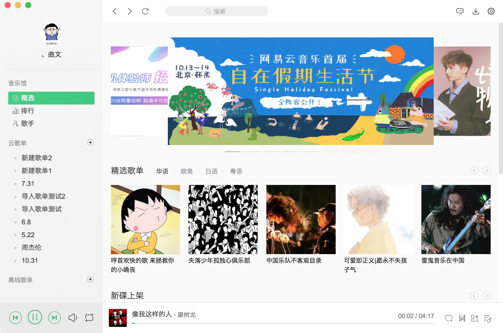
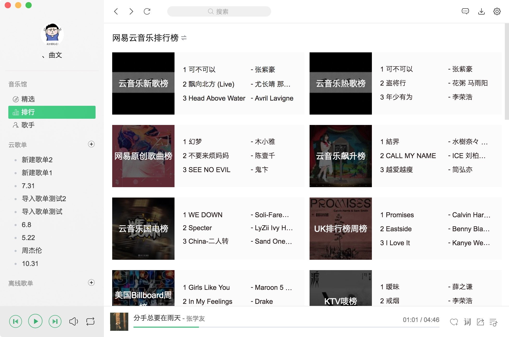
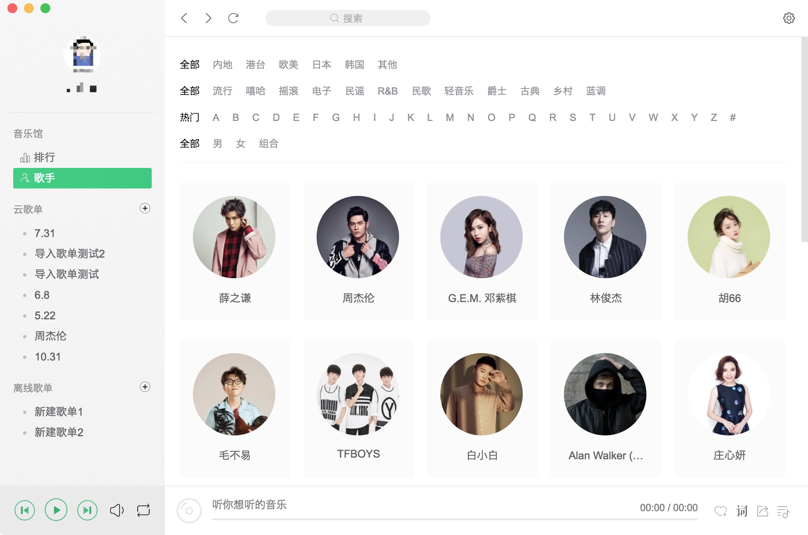
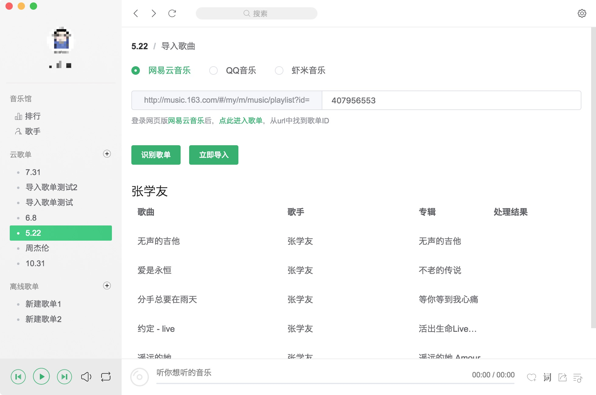
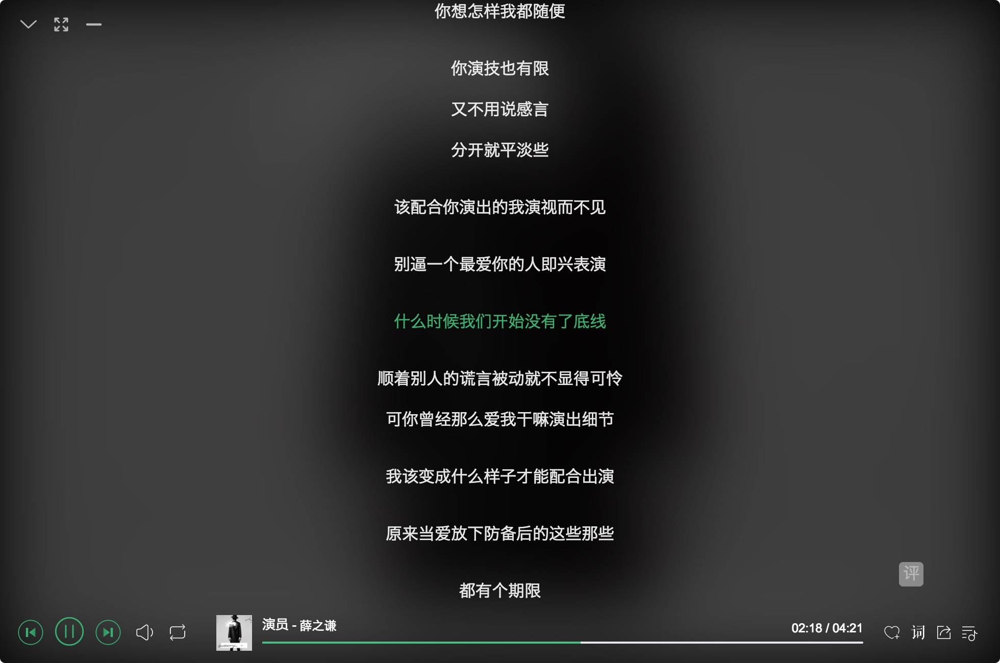
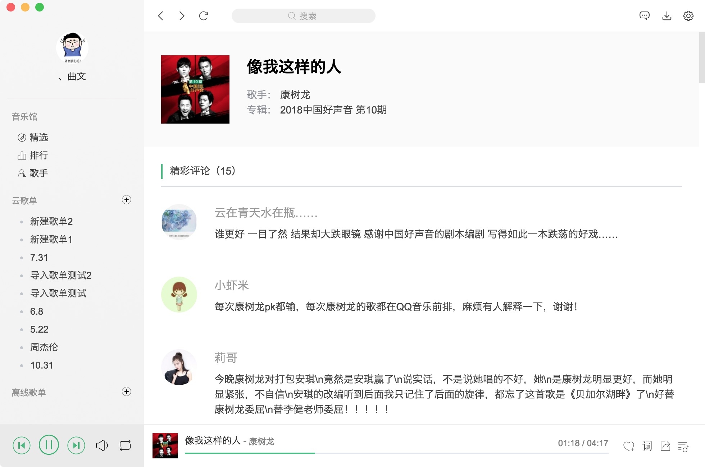
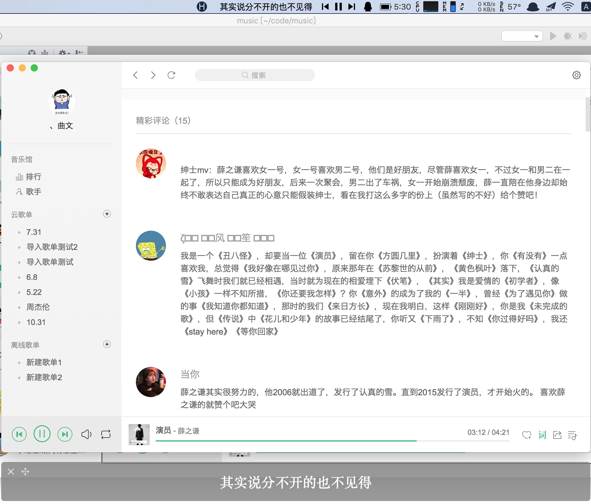

# music player

## 简介
- 歌曲Api涵盖网易云、QQ音乐、虾米
- 界面仿QQ音乐
- 登录、收藏、播放的流程基本没问题，可作为日用上班挂后台听歌程序
- 精力有限，需求不饱和都会逐步完善，有兴趣可赏个star静等完善与bug修复，期望的功能也可提issues
- [更新日志](https://github.com/Hxiaodou/music/blob/master/CHANGELOG.md)
- [下载页](https://github.com/Hxiaodou/music/releases) 
- [版本计划](https://github.com/Hxiaodou/music/projects)

## Feature
> 目前大家提的功能需求已全部解决！
> 如果此程序能满足你70%的日用需求，剩下的30%欢迎以[issues](https://github.com/Hxiaodou/music/issues)的形式告诉我
- 搜索 / 精选 / 榜单 / 歌手详情 / 专辑详情 / 歌曲评论 / 网易云MV
- 支持一键导入网易云、QQ音乐、虾米歌单
- 歌词翻译
- 下载（不能下载被云平台限制的歌曲，如会员限制）
- Mac状态栏歌词 / TouchBar播放控制 / 桌面歌词
- 快键键 / 全局快捷键
- 社会化分享：QQ、微博、微信等

## 版权声明
“QQ”、“QQ音乐”及企鹅形象等文字、图形和商业标识，其著作权或商标权归腾讯公司所有。 QQ音乐享有对其平台授权音乐的版权，请勿随意下载，复制版权内容。具体内容请参考QQ音乐用户协议。

> 为了尽可能不侵害音乐平台的版权，本程序做到了以下
- 不允许试听被限制的歌曲
- 不允许下载被限制的歌曲
- 分享使用原生h5分享，连文案都一样 :smirk:
- 所有搜索结果均注明来源音乐平台

## 关联项目
- [音乐解析Api](https://github.com/Hxiaodou/musicApi)

## 预览图
- 精选

- 排行

- QQ音乐歌手列表

- 快速导入歌单

- 全屏歌词

- 歌曲评论页

- Mac顶部状态栏歌词 + 桌面歌词

